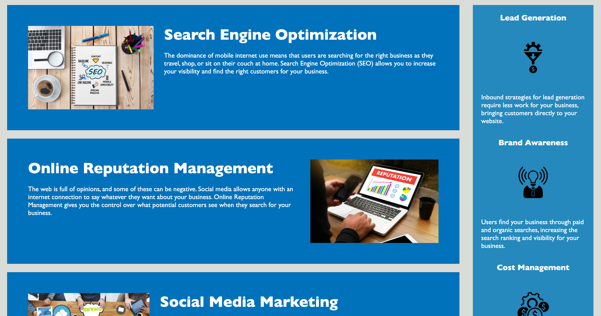

# Jessica Chen - Horiseon Website

## Columbia University Bootcamp - HTML CSS Git Challenge: Code Refactor

> This repository contains my refactored code of Horiseon Social Solution Services, Inc's website with accessibility support.
> Live Site: https://jess-n-chen.github.io/jc-cu-c1-horiseon/

## Table of Contents

- [General Info](#general-information)
- [Project Requirements](#project-requirements)
- [Screenshots](#screenshots)
- [Source Code](#source-code)
- [Contact](#contact)

## General Information

This repository hosts Horiseon's refactored website that meets all accessibility standards and improves Horiseon's search engine optimization.

## Project Requirements

User Story:

```
AS A marketing agency
I WANT a codebase that follows accessibility standards
SO THAT our site is optimized for search engines
```

Acceptance Criteria:

```
GIVEN a webpage that meets accessibility standards
WHEN I view the source code
THEN I find semantic HTML elements - done

WHEN I view the structure of the HTML elements
THEN I find that the elements follow a logical structure independent of styling and positioning - done

WHEN I view the icon and image elements
THEN I find accessible alt attributes

WHEN I view the heading attributes
THEN I find that they fall in sequential order

WHEN I view the title element
THEN I find a concise, descriptive title - done
```

## Screenshots




## Source Code

Source Code Reference: https://github.com/coding-boot-camp/urban-octo-telegram

## Contact

Created by: Jessica Chen | jessicachen28@gmail.com
